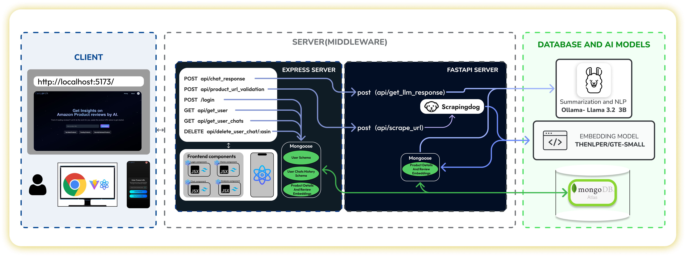

# ReviewBot Moblie App

## Project Overview

Sorting through thousands of customer reviews to make informed decisions can be overwhelming and time-consuming. Our project, ReviewBot, serves as a one-stop solution by leveraging AI-powered Natural Language Processing (NLP) to analyze, summarize, and understand product reviews. With a seamless frontend experience and a robust backend powered by FastAPI, Node.js, and advanced NLP models like Ollama llama 3.2, the app delivers concise and actionable insights. Users can quickly grasp the sentiment, key highlights, and common concerns from reviews, saving time and ensuring smarter decision-making.

---


## Tech Stack


### Frontend
- **React Native** Used to build a responsive and dynamic user interface, ensuring compatibility across android and IOS.
- **Expo** Supports features like asset management, push notifications, and easy testing on physical devices or emulators.

### Backend
- **Node.js**
- **Express** for API framework
- **MongoDB** for database management

### NLP Integration
- **FastAPI** for the Python-based NLP server
- **thenlper/gte-small** for embedding reviews
- **Ollama llama 3.2 3B** for NLP Summarization and Chatbot
---


## Features

- Interactive bot to analyze product reviews.
- Sentiment analysis for providing product review insights.
- User profile management.
- Responsive UI for a smooth user experience.

---

## Architecture Diagram



---

## Project Structure

The ReviewBot project is organized into three main sections:

- **Backend**: Manages core server-side logic and user operations.
- **FastAPI**: Handles NLP tasks like sentiment analysis using pre-trained models.
- **Frontend**: Provides the user interface through a React-Native based application.

---

## Directory Structure

This directory structure provides an overview of the organization within each section of the project.

### Backend

The backend of this project is structured to ensure scalability, modularity, and maintainability. Below is the directory structure with a brief description of each folder and file:
```plaintext

backend/
├── Controllers/           # Contains logic for handling application requests
│   ├── chatControllers.js    # Handles chat-related logic
│   └── userControllers.js    # Handles user-related logic
│
├── DB/                   # Database connection and configuration
│   └── dbconnection.js      # MongoDB connection setup
│
├── models/               # Schema definitions for MongoDB collections
│   ├── Chat.js              # Schema for chat data
│   ├── Product.js           # Schema for product data
│   └── User.js              # Schema for user data
│
├── routes/               # Defines API endpoints
│   ├── chatRoutes.js        # Routes for chat-related APIs
│   ├── index.js             # Centralized routing configuration
│   └── userRoutes.js        # Routes for user-related APIs
│
├── utils/                # Utility functions and reusable helpers
│   ├── Icons.js             # Manages application icons (if applicable)
│   └── tokenManager.js      # Handles token management for authentication
│
├── .dockerignore         # Specifies files to ignore during Docker builds
├── .env                  # Environment variables configuration
├── .gitignore            # Specifies files to ignore in Git
├── Dockerfile            # Dockerfile for containerizing the backend
├── Icons.js              # (Optional: seems like a misplaced file; verify usage)
├── index.js              # Main entry point of the backend
├── package-lock.json     # Lock file for npm dependencies
├── package.json          # Project metadata and dependencies

```